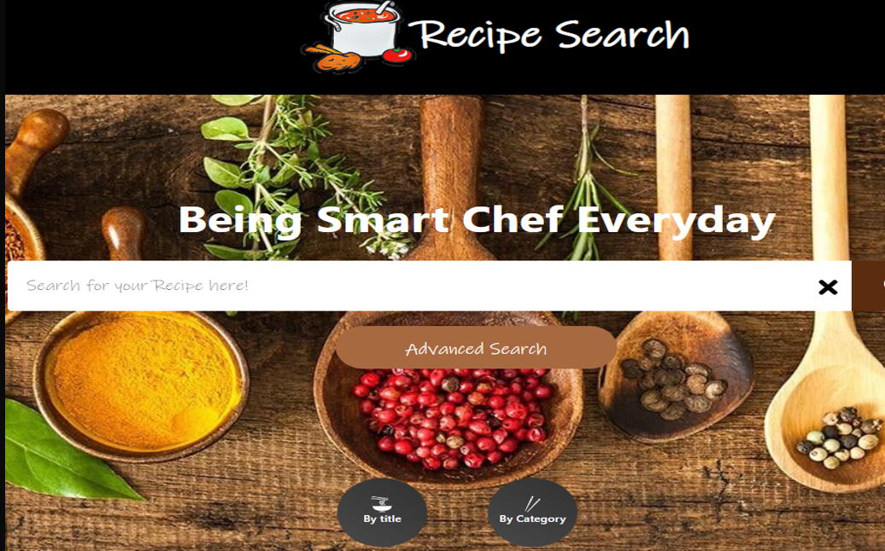
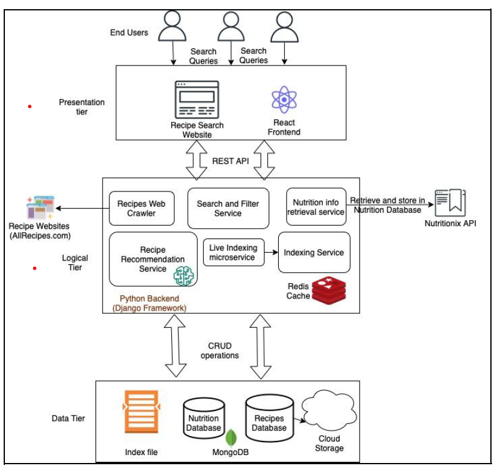

# Recipe Search Engine

## Overview

The Recipe Search System is a  tool that allows users to search for recipes based on their preferences and discover new recipes through personalized recommendations. This system leverages advanced search techniques and retrieval models to provide accurate and relevant results.

## UI Front Page
Upon accessing the Recipe Search Engine, users are greeted with an intuitive and visually appealing front page. The front page features a search bar where users can enter their desired recipe or ingredient.

## Features

1. **Free Text Search**: Users can enter specific ingredients, dish names, or cuisine types to search for relevant recipes. The system employs a default retrieval model based on TFIDF, which ensures accurate search results. Example queries:

   - "I want salads with fruits like orange, strawberry, and apple"
   - "I want recipes similar to apple pies"
   - "Indian cuisine recipes"

2. **Recommendations**: The system provides personalized recipe recommendations based on user preferences and browsing history. Some example recommendations include Festive Fruit Salad, Hawaiian Baked Beans And Franks, Barbara's Sugarless Apple Pie, and French Bread Pizza.

3. **Boolean Search**: Users can perform advanced searches using Boolean operators such as AND, OR, and NOT. This allows for more specific recipe queries. Example queries:

   - "Honey AND Chilli AND Potato"
   - "cheese AND sugar AND NOT milk"
   - "Banana AND apples AND orange AND kiwi"
   - "cheese AND sugar AND milk"

4. **Phrase Search**: Users can search for exact phrases by using quotation marks. This helps in finding recipes with specific ingredient combinations. Example queries:

   - "hot milk" AND sugar
   - "hot milk" AND sugar AND NOT flour
   - "ground cinnamon"

5. **Retrieval Models**: The system supports two retrieval models: TFIDF (default) and BM25. Users can choose the desired retrieval model for their searches.

6. **Expand Query**: The system offers an option to expand the query, providing additional recipe suggestions based on related keywords and ingredients.

7. **Nutrition Calculator**: Each recipe includes a nutrition table that displays the values for all ingredients used.

## Architecture

The Recipe Search and Recommendation System is built using a client-server architecture. The key components of the architecture include:

1. **Front-End Interface**: The user interacts with the system through a user-friendly web interface. It allows users to enter search queries, view search results, browse recipes, and access personalized recommendations.

2. **Backend Application**: The backend application handles the core logic of the system. It includes the search engine, retrieval models (TFIDF and BM25), recommendation algorithms, and nutrition calculator. The backend application communicates with the front-end interface to process user requests and provide appropriate responses.

3. **Database**: The system utilizes a database to store recipe data, including ingredients, instructions, nutrition information, and user preferences. The database allows for efficient retrieval and storage of recipe-related data.

4. **APIs**: The system may integrate with external APIs to fetch additional recipe data, such as ingredient details, nutritional information, and images. These APIs enhance the system's capabilities and provide comprehensive recipe results to the users.

## Usage

To use the Recipe Search System, follow these steps:

1. Access the web interface by opening the provided URL or running the application locally.

2. Enter your recipe search query in the search bar. You can use free text search, Boolean operators, or phrase search depending on your requirements.

3. Optionally, select a retrieval model (TFIDF or BM25) or enable the query expansion feature for more accurate results.

4. Click the search button to retrieve recipe suggestions based on your query.

5. Browse through the search results and click on a recipe to view detailed instructions, ingredients, and nutrition information.

6. To access personalized recommendations, create an account and log in to the system. The recommendations will be based on your browsing history and preferences.

## Installation
To run the recipe search engine locally, follow these steps:

1. Clone the repository: `git clone https://github.com/your-username/recipe-search.git`
2. Install the required dependencies: `pip install -r requirements.txt`
3. Run the application: `python app.py`
4. Open your web browser and visit `http://localhost:5000` to access the recipe search engine.

